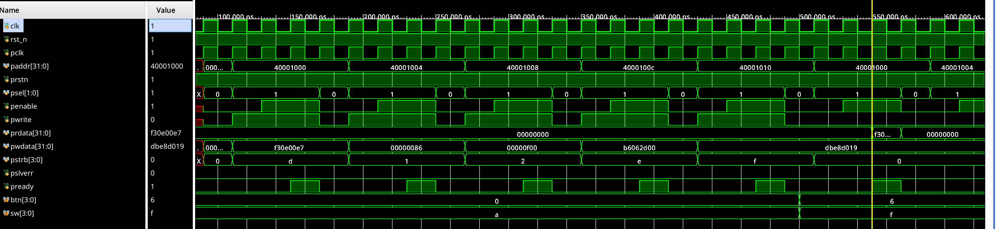

# apb_uvc
UVM APB UVC with Functional Coverage

## Overview

UVM-based APB Verification IP (VIP) with:
- **UVM Testbench**: Master/slave agents, scoreboard, RAL model
- **Functional Coverage**: Transaction patterns, B2B sequences, wait states
- **Code Coverage**: Line, branch, and condition coverage



## Directory Structure

```
├── sv/                       # UVM SystemVerilog files
│   ├── apb_interface.sv      # APB interface
│   ├── apb_coverage.sv       # Functional coverage groups
│   ├── apb_bus_monitor.sv    # APB Bust monitor & coverage collector
│   ├── apb_item.sv           # Transaction model
│   └── tb_top.sv             # TB top
│   
│
├── rtl/                      # DUT and top-level RTL
│   ├── top.sv                # RTL top with FPGA I/O
│   └── apb_slave_dut.sv      # APB slave DUT with registers
│
├── documentation/            # Waveforms and documentation
│
├── run.sh                    # Quick simulation script
└── README.md                 # This file
```

## Tests

| Test | Purpose | Coverage Focus |
|------|---------|----------------|
| `apb_wr_test` | Write then read | Basic transactions |
| `random_apb_test` | Random transactions | Coverage diversity |
| `apb_interleaved_test_seq` | Interleaved accesses | B2B patterns |
| `apb_reg_test_seq` | Register accesses | CSR space |
| `apb_ral_test_seq` | RAL model test | Full verification |

## Verification Flow

```
┌─────────────────────┐
│  Functional         │
│  Coverage           │
│  (Xcellium/EDA)     │
│  - Transaction      │
│  - B2B patterns     │
│  - Wait states      │
└──────────┬──────────┘
           │
           ▼
┌──────────────────────┐
│  Code Coverage       │
│  (Vivado/EDA)        │
│  - VIP implementation│
│  - Test coverage     │
└──────────────────────┘
```

